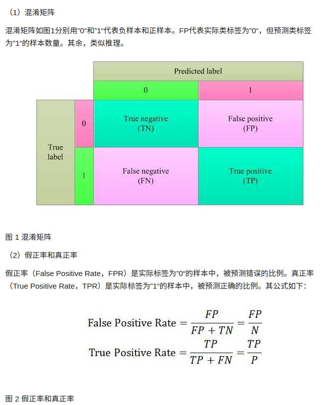

[TOC]
## NN推导
[BP推导](https://zhuanlan.zhihu.com/p/22399223)

[靠谱bp推导](http://ufldl.stanford.edu/wiki/index.php/%E5%8F%8D%E5%90%91%E4%BC%A0%E5%AF%BC%E7%AE%97%E6%B3%95)

[BN推导](https://zhuanlan.zhihu.com/p/25630415)

[DL常见面试题目](http://blog.csdn.net/woaidapaopao/article/details/77806273?locationNum=9&fps=1)

[word2vec](http://www.cnblogs.com/peghoty/p/3857839.html)

[梯度弥散和梯度爆炸](https://zhuanlan.zhihu.com/p/25631496)

[LSTM](http://www.jianshu.com/p/9dc9f41f0b29)

[非常好的一个全面给出各种网络前向后向推导的博客集合](https://www.zybuluo.com/hanbingtao/note/433855)

## 资料
[python类](http://www.jb51.net/article/49402.htm)

[机器学习面试](http://cdn2.jianshu.io/p/ace5051d0023)

[常见题目](http://blog.csdn.net/v_july_v/article/details/78121924)

[深度学习里的优化函数](https://zhuanlan.zhihu.com/p/22252270)

## LSH
### 特征问题
####连续特征离散化
一般在LR模型里，很少将连续值直接作为LR的输入，而是将连续特征离散化为一系列0,1特征交给逻辑回归模型，优势:
- 离散特征的增加和减少都很容易，易于快速迭代
- 稀疏向量内积乘法速度快，结果方便存储容易扩展
- 离散化后的特征对异常数据有很强的鲁棒性。
- 逻辑回归属于广义线性模型，表达能力受限；单变量离散化为N个后，每个变量有单独的权重，相当于为模型引入了非线性，能够提升模型表达能力，加大拟合
- 离散化后可以进行特征交叉，由M+N个变量变为M*N个变量，进一步引入非线性，提升表达能力
- 特征离散化后，模型会更稳定，比如如果对用户年龄离散化，20-30作为一个区间，不会因为一个用户年龄长了一岁就变成一个完全不同的人。当然处于区间相邻处的样本会刚好相反，所以怎么划分区间是门学问
- 特征离散化以后，起到了简化了逻辑回归模型的作用，降低了模型过拟合的风险。
- 用线性模型，就得通过离散化将非线性特征转化为线性的，这就是所谓特征工程。用非线性模型，比如Tree, DNN就不需要
#### 特征工程方法
1.计算每一个特征与响应变量的相关性：工程上常用的手段有计算皮尔逊系数和互信息系数，皮尔逊系数只能衡量线性相关性而互信息系数能够很好地度量各种相关性，但是计算相对复杂一些，好在很多toolkit里边都包含了这个工具（如sklearn的MINE），得到相关性之后就可以排序选择特征了.(其实就是计算输出关于输入的导数，如果某个特征很大程度上影响了输出，那么该特征就会比较重要)。

2. 构建单个特征的模型，通过模型的准确性为特征排序，借此来选择特征，另外，记得JMLR'03上有一篇论文介绍了一种基于决策树的特征选择方法，本质上是等价的。当选择到了目标特征之后，再用来训练最终的模型；

3. 通过L1正则项来选择特征：L1正则方法具有稀疏解的特性，因此天然具备特征选择的特性，但是要注意，L1没有选到的特征不代表不重要，原因是两个具有高相关性的特征可能只保留了一个，如果要确定哪个特征重要应再通过L2正则方法交叉检验；

4. 训练能够对特征打分的预选模型：RandomForest和Logistic Regression等都能对模型的特征打分，通过打分获得相关性后再训练最终模型；

5. 通过特征组合后再来选择特征：如对用户id和用户特征最组合来获得较大的特征集再来选择特征，这种做法在推荐系统和广告系统中比较常见，这也是所谓亿级甚至十亿级特征的主要来源，原因是用户数据比较稀疏，组合特征能够同时兼顾全局模型和个性化模型，这个问题有机会可以展开讲。

6. 通过深度学习来进行特征选择：目前这种手段正在随着深度学习的流行而成为一种手段，尤其是在计算机视觉领域，原因是深度学习具有自动学习特征的能力，这也是深度学习又叫unsupervisedfeature learning的原因。从深度学习模型中选择某一神经层的特征后就可以用来进行最终目标模型的训练了。

- 时间戳处理。保证时间数据是模型所需要的。
- 分解类别属性。除非类别只有两个类别，可以直接当成标量处理，否则都是要处理成onehot编码的方式。
- 连续特征离散化。将数值特征转换成类别，减少噪声干扰。可能需要了解属性的领域知识，确定属性能够划分成简洁的范围。
- 交叉特征。将两个或更多的类别属性组成一个。
- 特征选择。相关性。回归。
- 特征缩放。其实就是归一化。
#### 皮尔逊相关系数
其实就是余弦相似度。协方差除以两个变量的标准差。物理上表示是两个向量的夹角。
#### 特征组合
[参考](http://blog.csdn.net/icvpr/article/details/12342159)
## 熵，交叉熵，相对熵
熵的本质是对香农信息量的期望。交叉熵H(p,q)表示对应真实分布p，使用q分布来进行编码所需要的平均编码长度。H(p)表示平均编码长度。相对熵即为二者之差，指的是由q编码得到的平均长度比由p得到的平均编码长度多出的bit数称为相对熵。也称为KL散度，表示两个函数或者概率分布的差异性。差异性越大相对熵越大。[参考](https://www.zhihu.com/question/41252833)
如TFIDF就可以理解为相对熵，词频在整个语料库的分布与词频在具体文档中的分布之间的差异性。
在一份给定的文件里，词频 (term frequency, TF) 指的是某一个给定的词语在该文件中出现的次数。这个数字通常会被归一化（分子一般小于分母 区别于IDF），以防止它偏向长的文件。（同一个词语在长文件里可能会比短文件有更高的词频，而不管该词语重要与否。）

　　逆向文件频率 (inverse document frequency, IDF) 是一个词语普遍重要性的度量。某一特定词语的IDF，可以由总文件数目除以包含该词语之文件的数目，再将得到的商取对数得到。

　　某一特定文件内的高词语频率，以及该词语在整个文件集合中的低文件频率，可以产生出高权重的TF-IDF。因此，TF-IDF倾向于过滤掉常见的词语，保留重要的词语。
## AUC

仔细看这两个公式，发现其实TPRate就是TP除以TP所在的列，FPRate就是FP除以FP所在的列。
TPRate的意义是所有真实类别为1的样本中，预测类别为1的比例。
FPRate的意义是所有真是类别为0的样本中，预测类别为1的比例。
按照定义，AUC即ROC曲线下的面积，而ROC曲线的横轴就是FPRate，纵轴就是TPRate，当二者相等时，即y=x，如下图，表示的意义则是：对于不论真实类别是1还是0的样本，分类器预测为1的概率是相等的，换句话说，和抛硬币并没有什么区别，一个抛硬币的分类器是我们能想象的最差的情况，因此AUC极小值为0.5。
而我们需要分类器达到的效果是：对于真实类别为1的样本预测为1的概率（即TPRate），要大于真实类别为0而预测类别为1的概率（即FPRate），这样的ROC曲线是在y=x之上的，因此大部分的ROC曲线长成下面这个样子.
最理想的情况下，没有真实类别为1而错分为0的样本，TPRate一直为1，于是AUC为1，这便是AUC的极大值。
auc就是涵盖了全部阈值下模型的综合分类能力。因此从这一点来说，评判模型或者说分类器的好坏，就在于评判这个模型让病人排队sort方式的本事有多大。

顺便说下几个指标:
精确率(precision):即为在预测为坏人中，真正确实是坏人的比例。
召回率(recall):即为在实际所有坏人里，预测正确的占比。
F1值是精确率和召回率的调和均值。
Fa值相当于使用a给P和R给予了不同的权重。
PRC曲线的横轴是真阳率(True Positive),纵轴是召回率。随着TPR的增长，精确率其实不一定是什么，所以曲线不是单调的。
KS评价:max(TPR-FRR),反映模型的最优区分效果，此时所取的阈值一般定义为最优阈值。
参考:[知乎](https://www.zhihu.com/question/30643044).[知乎](https://www.zhihu.com/question/39840928)
## 逻辑回归
[zhihu](https://zhuanlan.zhihu.com/p/28775274)
主要是关注其中几点:利用了sigmod函数将线性回归纳入到一个类似的概率预测函数里去。并且由此推导出极大似然函数公式，从而对其取对数，得到损失函数。一般求解方法是梯度下降和L-BFGS。
多元逻辑回归的处理:
假设K分类。常见的方法是构建K个二分类器。而后预测的时候取其中最大的那个。
或者是借用softmax函数。不过此时网络输出的是K个值，也就是说参数W此时是一个N*K的矩阵。对矩阵结果使用softmax归一化。softmax的损失函数可以借鉴logloss。
一般的话如果是多个类别有关联则使用第一种，反之使用第二种。
[cankao](http://blog.csdn.net/xbinworld/article/details/45291009)里面有个小错误。softmax时y(i)==j写成了y(i)==1.
## 最大熵模型
[最大熵](https://zhuanlan.zhihu.com/p/29861148)
其认为在所有可能的概率模型分布里，熵最大的是最好的模型。即在满足约束条件的模型集合里选取熵最大的模型。
给定一个特征函数，其对应于经验分布的期望值和关于条件概率分布的期望值，二者应该相等。这就可以作为约束条件。而其优化的目标即为最大化条件分布的熵。
对偶函数的极大化等价于最大熵模型的极大似然估计。最大熵模型与逻辑回归有类似的形式，他们称为对数线性模型。模型学习就是在给定的训练数据条件下对模型进行极大似然估计或正则化的极大似然估计。
## LR
[zhihu](https://zhuanlan.zhihu.com/p/29549888)
## EM算法
[例子](http://www.jianshu.com/p/1121509ac1dc)
## Xgboost和GBDT区别
[ctq本人文章](http://www.52cs.org/?p=429)
1.传统GBDT以CART作为基分类器，xgboost还支持线性分类器，这个时候xgboost相当于带L1和L2正则化项的逻辑斯蒂回归（分类问题）或者线性回归（回归问题）。

2.传统GBDT在优化时只用到一阶导数信息，xgboost则对代价函数进行了二阶泰勒展开，同时用到了一阶和二阶导数。顺便提一下，xgboost工具支持自定义代价函数，只要函数可一阶和二阶求导。

3.Xgboost在代价函数里加入了正则项，用于控制模型的复杂度。正则项里包含了树的叶子节点个数、每个叶子节点上输出的score的L2模的平方和。从Bias-variance tradeoff角度来讲，正则项降低了模型的variance，使学习出来的模型更加简单，防止过拟合，这也是xgboost优于传统GBDT的一个特性。

4.Shrinkage（缩减），相当于学习速率（xgboost中的eta）。xgboost在进行完一次迭代后，会将叶子节点的权重乘上该系数，主要是为了削弱每棵树的影响，让后面有更大的学习空间。实际应用中，一般把eta设置得小一点，然后迭代次数设置得大一点。（补充：传统GBDT的实现也有学习速率）

5.列抽样（column subsampling）。xgboost借鉴了随机森林的做法，支持列抽样，不仅能降低过拟合，还能减少计算，这也是xgboost异于传统gbdt的一个特性。

6.缺失值的处理。对于特征的值有缺失的样本，xgboost可以自动学习出它的分裂方向。

7.xgboost工具支持并行。boosting不是一种串行的结构吗?怎么并行的？注意xgboost的并行不是tree粒度的并行，xgboost也是一次迭代完才能进行下一次迭代的（第t次迭代的代价函数里包含了前面t-1次迭代的预测值）。xgboost的并行是在特征粒度上的。我们知道，决策树的学习最耗时的一个步骤就是对特征的值进行排序（因为要确定最佳分割点），xgboost在训练之前，预先对数据进行了排序，然后保存为block结构，后面的迭代中重复地使用这个结构，大大减小计算量。这个block结构也使得并行成为了可能，在进行节点的分裂时，需要计算每个特征的增益，最终选增益最大的那个特征去做分裂，那么各个特征的增益计算就可以开多线程进行。

8.可并行的近似直方图算法。树节点在进行分裂时，我们需要计算每个特征的每个分割点对应的增益，即用贪心法枚举所有可能的分割点。当数据无法一次载入内存或者在分布式情况下，贪心算法效率就会变得很低，所以xgboost还提出了一种可并行的近似直方图算法，用于高效地生成候选的分割点。
[参考](http://sofasofa.io/forum_main_post.php?postid=1000331)
[海森矩阵](http://sofasofa.io/forum_main_post.php?postid=1000453&)
[知乎](https://zhuanlan.zhihu.com/p/30316845)
[知乎](https://www.zhihu.com/question/41354392)
## SVM
[CSDN](http://blog.csdn.net/v_july_v/article/details/7624837)
一个比较全面的SVM笔记。前面几何间隔和对偶问题肯定要知道，另外对偶问题关于对W和B求导使得导数为0而后进行式子化简。
[SVM靠谱推导](http://blog.csdn.net/sinat_35512245/article/details/54984251)
## 决策树
[靠谱描述](http://www.jianshu.com/p/fb97b21aeb1d)
[cart剪枝](http://blog.csdn.net/u014688145/article/details/53326910)
## 生成模型和判别模型的区别
生成方法由数据学习联合概率分布，然后求出条件概率分布。模型表示了给定X产生输出Y的生成关系。如朴素贝叶斯方法和隐马尔科夫方法。特点是可以还原出概率分布。学习收敛速度更快，当样本容量增加时候，学习的模型可以更快的收敛于真实模型。当存在隐变量时，仍然可以用生成方法学习。
判别方法由数据直接学习决策函数或者条件概率分布。其关心的是对给定的X应该输出什么样的Y。如KNN，感知机决策树，逻辑回归，最大熵，svm，boosting和crf。特点是其直接面对预测，准确度往往更高。由于其直接学习条件概率分布或者决策函数，可以对数据进行各种程度上的抽象，定义特征并使用特征，可以简化学习问题。

## 海量数据题目
[博客](http://blog.csdn.net/v_july_v/article/details/6279498)
## python
### 列表和元组的区别
1.不可变和可变。元组是不可变对象，其值不能更改。列表是可变对象，对象可以对元素进行更改，添加，删除，清空，排序等操作。
2.可哈希和不可哈希。可哈希对象就是能够映射成内存地址的对象。在python基本类型里，只有列表字典和可变集合是不可哈希的。但说元组可哈希也不全对，因为如果元组里某个元素是列表字典和可变集合那么元组也不可哈希。可哈希和不可哈希的区别:可哈希对象可以作为字典的键和集合的元素，不可哈希对象则不可。
## 排序
```python
#插入排序 插入排序的基本操作就是将一个数据插入到已经排好序的有序数据中，从而得到一个新的、个数加一的有序数据，算法适用于少量数据的排序，时间复杂度为O(n^2)。是稳定的排序方法。插入算法把要排序的数组分成两部分：第一部分包含了这个数组的所有元素，但将最后一个元素除外（让数组多一个空间才有插入的位置），而第二部分就只包含这一个元素（即待插入元素）。在第一部分排序完成后，再将这个最后元素插入到已排好序的第一部分中。
def insert_sort(lists):
    # 插入排序
    count = len(lists)
    for i in range(1, count):
        key = lists[i]
        j = i - 1
        while j >= 0:
            if lists[j] > key:
                lists[j + 1] = lists[j]
                lists[j] = key
            j -= 1
    return lists
#希尔排序(Shell Sort)是插入排序的一种。也称缩小增量排序，是直接插入排序算法的一种更高效的改进版本。希尔排序是非稳定排序算法。该方法因DL．Shell于1959年提出而得名。 希尔排序是把记录按下标的一定增量分组，对每组使用直接插入排序算法排序；随着增量逐渐减少，每组包含的关键词越来越多，当增量减至1时，整个文件恰被分成一组，算法便终止。
def shell_sort(lists):
    # 希尔排序
    count = len(lists)
    step = 2
    group = count / step
    while group > 0:
        for i in range(0, group):
            j = i + group
            while j < count:
                k = j - group
                key = lists[j]
                while k >= 0:
                    if lists[k] > key:
                        lists[k + group] = lists[k]
                        lists[k] = key
                    k -= group
                j += group
        group /= step
    return lists

#冒泡排序 它重复地走访过要排序的数列，一次比较两个元素，如果他们的顺序错误就把他们交换过来。走访数列的工作是重复地进行直到没有再需要交换，也就是说该数列已经排序完成。
def bubble_sort(lists):
    # 冒泡排序
    count = len(lists)
    for i in range(0, count):
        for j in range(i + 1, count):
            if lists[i] > lists[j]:
                lists[i], lists[j] = lists[j], lists[i]
    return lists
#快速排序 通过一趟排序将要排序的数据分割成独立的两部分，其中一部分的所有数据都比另外一部分的所有数据都要小，然后再按此方法对这两部分数据分别进行快速排序，整个排序过程可以递归进行，以此达到整个数据变成有序序列。
def quick_sort(lists, left, right):
    # 快速排序
    if left >= right:
        return lists
    key = lists[left]
    low = left
    high = right
    while left < right:
        while left < right and lists[right] >= key:
            right -= 1
        lists[left] = lists[right]
        while left < right and lists[left] <= key:
            left += 1
        lists[right] = lists[left]
    lists[right] = key
    quick_sort(lists, low, left - 1)
    quick_sort(lists, left + 1, high)
    return lists
#直接选择排序  基本思想：第1趟，在待排序记录r1 ~ r[n]中选出最小的记录，将它与r1交换；第2趟，在待排序记录r2 ~ r[n]中选出最小的记录，将它与r2交换；以此类推，第i趟在待排序记录r[i] ~ r[n]中选出最小的记录，将它与r[i]交换，使有序序列不断增长直到全部排序完毕。
def select_sort(lists):
    # 选择排序
    count = len(lists)
    for i in range(0, count):
        min = i
        for j in range(i + 1, count):
            if lists[min] > lists[j]:
                min = j
        lists[min], lists[i] = lists[i], lists[min]
    return lists

#堆排序  堆排序(Heapsort)是指利用堆积树（堆）这种数据结构所设计的一种排序算法，它是选择排序的一种。可以利用数组的特点快速定位指定索引的元素。堆分为大根堆和小根堆，是完全二叉树。大根堆的要求是每个节点的值都不大于其父节点的值，即A[PARENT[i]] >= A[i]。在数组的非降序排序中，需要使用的就是大根堆，因为根据大根堆的要求可知，最大的值一定在堆顶。
def adjust_heap(lists, i, size):
    lchild = 2 * i + 1
    rchild = 2 * i + 2
    max = i
    if i < size / 2:
        if lchild < size and lists[lchild] > lists[max]:
            max = lchild
        if rchild < size and lists[rchild] > lists[max]:
            max = rchild
        if max != i:
            lists[max], lists[i] = lists[i], lists[max]
            adjust_heap(lists, max, size)

def build_heap(lists, size):
    for i in range(0, (size/2))[::-1]:
        adjust_heap(lists, i, size)

def heap_sort(lists):
    size = len(lists)
    build_heap(lists, size)
    for i in range(0, size)[::-1]:
        lists[0], lists[i] = lists[i], lists[0]
        adjust_heap(lists, 0, i)

#归并排序是建立在归并操作上的一种有效的排序算法,该算法是采用分治法（Divide and Conquer）的一个非常典型的应用。将已有序的子序列合并，得到完全有序的序列；即先使每个子序列有序，再使子序列段间有序。若将两个有序表合并成一个有序表，称为二路归并。

#归并过程为：比较a[i]和a[j]的大小，若a[i]≤a[j]，则将第一个有序表中的元素a[i]复制到r[k]中，并令i和k分别加上1；否则将第二个有序表中的元素a[j]复制到r[k]中，并令j和k分别加上1，如此循环下去，直到其中一个有序表取完，然后再将另一个有序表中剩余的元素复制到r中从下标k到下标t的单元。归并排序的算法我们通常用递归实现，先把待排序区间[s,t]以中点二分，接着把左边子区间排序，再把右边子区间排序，最后把左区间和右区间用一次归并操作合并成有序的区间[s,t]。

def merge(left, right):
    i, j = 0, 0
    result = []
    while i < len(left) and j < len(right):
        if left[i] <= right[j]:
            result.append(left[i])
            i += 1
        else:
            result.append(right[j])
            j += 1
    result += left[i:]
    result += right[j:]
    return result

def merge_sort(lists):
    # 归并排序
    if len(lists) <= 1:
        return lists
    num = len(lists) / 2
    left = merge_sort(lists[:num])
    right = merge_sort(lists[num:])
    return merge(left, right)

#基数排序（radix sort）属于“分配式排序”（distribution sort），又称“桶子法”（bucket sort）或bin sort，顾名思义，它是透过键值的部份资讯，将要排序的元素分配至某些“桶”中，藉以达到排序的作用，基数排序法是属于稳定性的排序，其时间复杂度为O (nlog(r)m)，其中r为所采取的基数，而m为堆数，在某些时候，基数排序法的效率高于其它的稳定性排序法。
import math
def radix_sort(lists, radix=10):
    k = int(math.ceil(math.log(max(lists), radix)))
    bucket = [[] for i in range(radix)]
    for i in range(1, k+1):
        for j in lists:
            bucket[j/(radix**(i-1)) % (radix**i)].append(j)
        del lists[:]
        for z in bucket:
            lists += z
            del z[:]
    return lists
```
## 3sum
```python
class Solution:
    # @return a list of lists of length 3, [[val1,val2,val3]]
    def threeSum(self, num):
        num.sort()
        res = []
        for i in range(len(num)-2):
            if i == 0 or num[i] > num[i-1]:
                left = i + 1; right = len(num) - 1
                while left < right:
                    if num[left] + num[right] == -num[i]:
                        res.append([num[i], num[left], num[right]])
                        left += 1; right -= 1
                        while left < right and num[left] == num[left-1]: left +=1
                        while left < right and num[right] == num[right+1]: right -= 1
                    elif num[left] + num[right] < -num[i]:
                        while left < right:
                            left += 1
                            if num[left] > num[left-1]: break
                    else:
                        while left < right:
                            right -= 1
                            if num[right] < num[right+1]: break
        return res
```
## kmp
下面给出一个讲解，而后给出python版本的kmp写法
```python
#coding=utf8
#字符串查找，S为长串，T为目标串。从S中查找T串。只考虑查找是否存在并返回最前面坐标。不考虑多次出现。
def makenext(T):
    #制作next数组
    next = []
    next.append(-1)#最开头就失陪，那只有-1与之相配了
    j = -1#目前已经匹配的坐标的最后一位
    for i in range(1,len(T)):
        while j>=0 and T[j+1]!=T[i]:
            j = next[j]
        if T[j+1]==T[i]:
            j = j + 1
        next.append(j)
    return next

def search(S,T,all=False):
    j = -1#代表T串里已经匹配好的坐标
    i = 0#代表目前比较的是S的坐标
    can = False
    next = makenext(T)
    for i in range(len(S)):
        while j>=0 and T[j+1]!=S[i]:
            j = next[j]
        if T[j+1]==S[i]:
            j = j + 1
        if j == len(T)-1:
            if all==False:
                can = True
                return (True,i-len(T)+1)
            else:
                can = True
                print(True,i-len(T)+1)
                j = next[j]
    if can ==False:
        return False
    else:
        pass

print(search('hgfjgfjfgjjhyasdfsfsdfsfsdfsfrfgffd','dfsfsdfs',True))

```
## 二叉树遍历
```python
    def front_digui(self, root):
        """利用递归实现树的先序遍历"""
        if root == None:
            return
        print root.elem,
        self.front_digui(root.lchild)
        self.front_digui(root.rchild)


    def middle_digui(self, root):
        """利用递归实现树的中序遍历"""
        if root == None:
            return
        self.middle_digui(root.lchild)
        print root.elem,
        self.middle_digui(root.rchild)


    def later_digui(self, root):
        """利用递归实现树的后序遍历"""
        if root == None:
            return
        self.later_digui(root.lchild)
        self.later_digui(root.rchild)
        print root.elem,


    def front_stack(self, root):
        """利用堆栈实现树的先序遍历"""
        if root == None:
            return
        myStack = []
        node = root
        while node or myStack:
            while node:                     #从根节点开始，一直找它的左子树
                print node.elem,
                myStack.append(node)
                node = node.lchild
            node = myStack.pop()            #while结束表示当前节点node为空，即前一个节点没有左子树了
            node = node.rchild                  #开始查看它的右子树


    def middle_stack(self, root):
        """利用堆栈实现树的中序遍历"""
        if root == None:
            return
        myStack = []
        node = root
        while node or myStack:
            while node:                     #从根节点开始，一直找它的左子树
                myStack.append(node)
                node = node.lchild
            node = myStack.pop()            #while结束表示当前节点node为空，即前一个节点没有左子树了
            print node.elem,
            node = node.rchild                  #开始查看它的右子树


    def later_stack(self, root):
        """利用堆栈实现树的后序遍历"""
        if root == None:
            return
        myStack1 = []
        myStack2 = []
        node = root
        myStack1.append(node)
        while myStack1:                   #这个while循环的功能是找出后序遍历的逆序，存在myStack2里面
            node = myStack1.pop()
            if node.lchild:
                myStack1.append(node.lchild)
            if node.rchild:
                myStack1.append(node.rchild)
            myStack2.append(node)
        while myStack2:                         #将myStack2中的元素出栈，即为后序遍历次序
            print myStack2.pop().elem,


    def level_queue(self, root):
        """利用队列实现树的层次遍历"""
        if root == None:
            return
        myQueue = []
        node = root
        myQueue.append(node)
        while myQueue:
            node = myQueue.pop(0)
            print node.elem,
            if node.lchild != None:
                myQueue.append(node.lchild)
            if node.rchild != None:
                myQueue.append(node.rchild)

```
## 并查集
```python
class UF:
    def __init__(self,size):
        self.data = [i for i in range(size)]
    def unit(self,x,y):
        fx = self.find(x)
        fy = self.find(y)
        if fx!=fy:
            self.data[fx] = fy
    def find(self,x):
        #查找根
        r = x
        while self.data[r]!=r:
            r = self.data[r]
        #压缩路径
        i = x
        while i!=r:
            j = self.data[i]
            self.data[i]=r
            i = j
        return r
    def same(self,x,y):
        return self.find(x)==self.find(y)
'''
uf = UF(5)
uf.unit(1,3)
uf.unit(2,4)
uf.unit(3,4)
print uf.find(1)
print uf.find(4)
'''
```
## Trie树
```python
class TrieNode():
    def __init__(self):
        self.children = collections.defaultdict(TrieNode)
        self.isWord = False

class Trie():
    def __init__(self):
        self.root = TrieNode()

    def insert(self, word):
        node = self.root
        for w in word:
            node = node.children[w]
        node.isWord = True

    def search(self, word):
        node = self.root
        for w in word:
            node = node.children.get(w)
            if not node:
                return False
        return node.isWord
```
